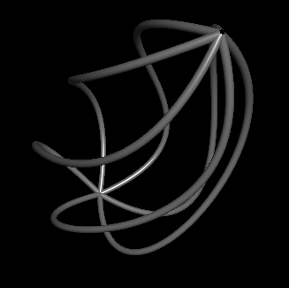
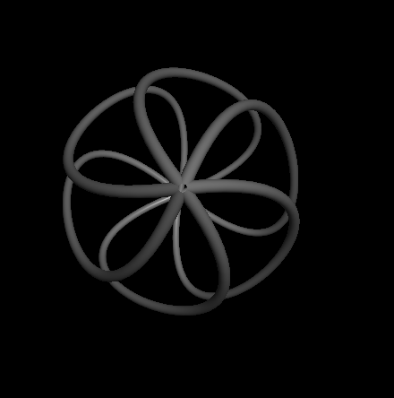
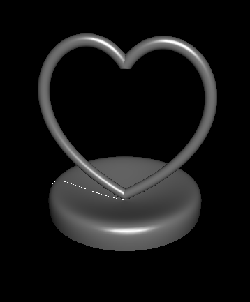
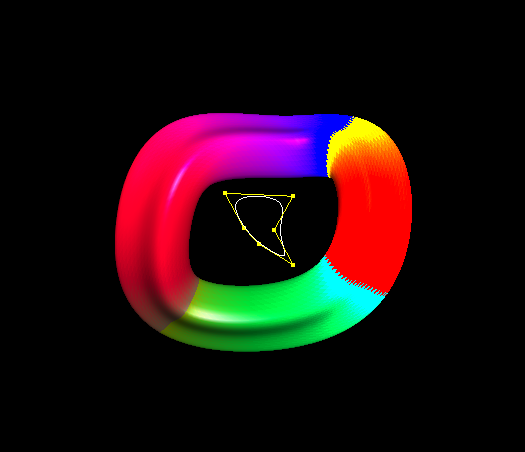
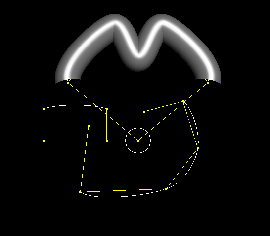
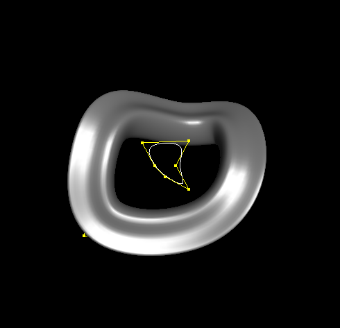
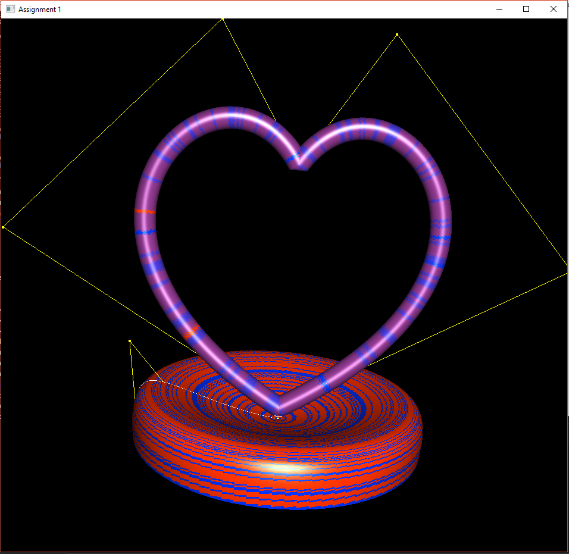
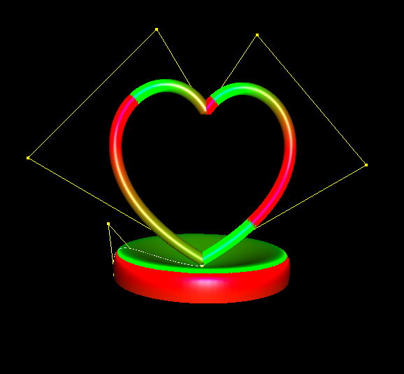

# GraphicsAssignment1
## Executables
oneBasic.exe - Main Assignment objectives achieved
one3Bonus.exe - executable with bonuses implemented
## Important Files
/swp - has all the SWP Files
/images - has all the screenshots of the project
/swp/catmull.swp - tester files for catmull rom
## Artifacts
#### first artifact

#### second artifact

## Resources
- https://pomax.github.io/bezierinfo/#decasteljau

## Bonuses Attempted:
- Easy 1

- Easy 2

- Easy 4

## Notes on Bonuses
Although the surface color one asked me to change I didnt like the color that was generated based off the curvature (was a little flat)

Instead I created another way to interpret the colors based on the magnitude of the K vector and changed their color based on the ratio of the direction the vector is pointing in which generates a really cool colorful effect instead.

